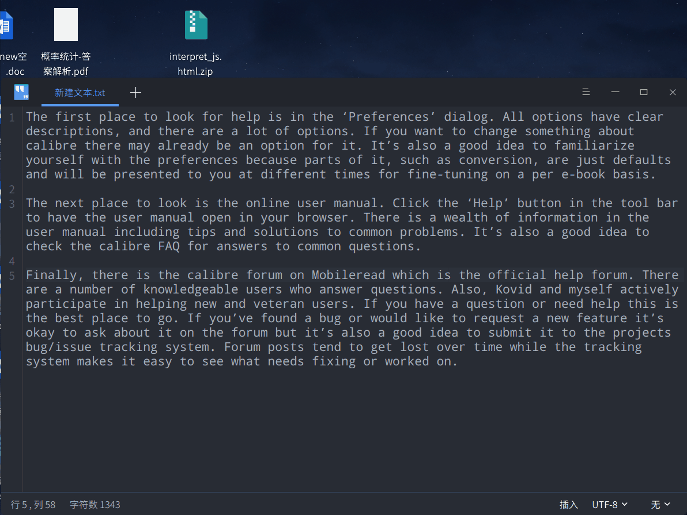

# CuteTranslation
## 简介
CuteTranslation 是Linux系统上基于X11的一款取词翻译软件。


功能：
1. 取词翻译   
	  
2. 截图翻译  
	
3. 悬浮搜索框  
	

特点：
+ Google翻译插件风格
+ html css js 渲染界面
+ 对接百度翻译
+ 百度AI：OCR识别图片内容并翻译
+ 个性化的配置
+ 快捷键 悬浮窗口

## 使用
正在开发中，预计2020年1月-2月正式发布。
## 编译
为 Debian 系的发行版安装开发库
```bash
# Qt
sudo apt install qt5-default libxtst-dev g++  make
sudo apt install libqt5x11extras5 libqt5webengine5 libqt5webenginewidgets5 qtwebengine5-dev
# JS
sudo apt install nodejs
# Python3
pip3 install PyExecJS
pip3 install requests
```
qmake 编译
```bash
mkdir build && cd build
qmake ..
make
```
安装
```
# 安装到build目录
bash install.sh build

# 安装到 /opt/CuteTranslation
sudo bash install.sh
sudo chown -R $USER /opt/CuteTranslation
```
运行
```
./CuteTranslation
```
## 感谢
+ [words-picker](https://github.com/ziqiangxu/words-picker)
+ [ScreenTranslation](https://github.com/ziqiangxu/words-picker)
+ [BaiduTranslate](https://github.com/ZCY01/BaiduTranslate)