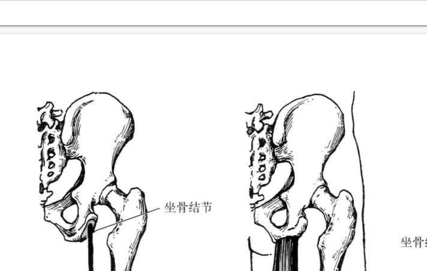

# CuteTranslation

     
<br/>

## 简介
CuteTranslation是Linux系统上基于X11的一款取词翻译软件,帮助用户翻译多种语言的文字。目前提供amd64、arm64、mips64三种CPU架构的deb安装包。

功能：  
1. 取词翻译： 中英互译、汉语解释、识别诗词文言文   
      

      

      

2. OCR，截图翻译  
       

          

3. 悬浮搜索框  
       

特点：
+ Google翻译插件风格
+ QWidget界面，有不同颜色的主题
+ 对接百度翻译
+ 百度AI：OCR识别图片内容并翻译
+ 个性化的配置
+ 快捷键 悬浮窗口
+ 只支持X11，不支持wayland


## 使用
**安装**

推荐下载deb包后用命令安装。安装失败、程序报警、出错请跳转到[故障排查](#jump)。
```bash
sudo apt-get install  ./CuteTranslation_v0.1.0_amd64.deb
```

**基本功能**

打开软件，系统托盘栏会出现一个圆形图标。当你用鼠标选中一段文字后，鼠标旁边会出现一个小方块(FloatButton)，点击后触发翻译功能。双击、右键托盘图标可以查看更多功能。

测试文本：  

>Players around the world join forces on one of two teams of four in the Great Ghoul Duel. Exploring one of several spooky maps, players must collect as many wandering spirit flames as they can in two minutes and return them to their homebase. After time’s up, the team that has collected the most spirit flames wins. But beware! - opponents can intercept spirits from one another as they bring them back to homebase.

>パン業界では、品切れを嫌って多めに作るために売れ残りの廃棄が常態化しており、ロス率は平均３～５％といわれている。「食べ物を大事にしなさい」としつけられた前田さんは、「売れ残りや廃棄の問題に目をつぶったままで店を続けられない」。智美さんと新しい業態を考え、昨年６月にいったん休業。２カ月ほど後に新しい店として再出発した。

**截图翻译**

按下快捷键 alt+q 或 右键托盘栏图标选择“截图翻译” 触发截图翻译。这时鼠标会变成十字星，选中要翻译的区域即可。

**悬浮搜索框**  

按下快捷键 alt+w 或 右键托盘栏图标选择“文字翻译” 打开悬浮搜索框。输入文字后按下回车键触发翻译。按下 alt+w 或 右侧按钮关闭悬浮搜索框。

**OCR文字识别**

按下快捷键 alt+e 或 右键托盘栏图标选择“文字识别” 触发文字识别。这时鼠标会变成十字星，选中要识别的区域即可。

**取词模式**  

有三种取词模式可供选择：全局、自定义、禁用。  
自定义指的是只在某些窗口上启动取词功能，或只在某些窗口上禁用取词功能。
选中一段文字，右键鼠标旁边的小方块(FloatButton)，点击“不要在XXX中显示”。被禁止取词的软件可以在配置窗口中看到。配置窗口中右键列表可移除选项。

**翻译界面附加功能** 

翻译界面右上角有一排按钮：换行处理、刷新、固定、关闭等。

如果翻译结果为"time out"，说明网络请求超时。点击翻译界面右上角的刷新按钮可重新翻译。

鼠标点击其他的地方，翻译界面会自动隐藏。点击翻译界面右上角的固定按钮可固定翻译界面。关闭被固定的界面需要点击右上角的关闭按钮。

换行处理可以忽略文本中的换行符。在某些软件如PDF阅读器中，如果直接选中以下段落翻译，效果会很差。这时点击翻译界面的N按钮，重新选中段落翻译，可以优化翻译效果。
>The Python installers for the Windows platform usually  
> include the entire standard library and often also include  
>  many additional components. For Unix-like operating systems  
>   Python is normally provided as a collection of packages,  
>   so it may be necessary to use the packaging tools provided  
>    with the operating system to obtain some or all of the optional  components.

**配置文件**

CuteTranslation提供了多种多样的配置选项，例如界面大小、快捷键、缩放比例等等。配置文件位于 ~/.local/share/CuteTranslation/config.ini 

术语表
```
ConfigTool       配置工具
Picker           取词功能
ConfigWindow     配置界面
MainWindow       翻译界面
FloatButton      悬浮按钮
SystemTrayIcon   托盘栏
ShortCut         快捷键
SearchBar        悬浮搜索框
```
CuteTranslation 默认配置   [config.ini](https://github.com/jiangzc/CuteTranslation/blob/master/template/config.ini)

因为每个人显示器大小和缩放比例不同，所以要把窗口大小调到合适的值。例如15.6寸笔记本电脑用以下配置比较合适。24寸左右屏幕推荐WebPageZoomFactor=1.0，增加 MainWindowWidth。
```ini
[MainWindow]
MainWindowHeight=400
MainWindowWidth=500
WebPageZoomFactor=1.2
```
您可以根据自己的喜好设置截图翻译和悬浮搜索框的快捷键
```ini
[ShortCut]
ScreenShot=alt+q
SearchBar=alt+w
```
设置网络请求最大延时
```ini
[Translate]
OCRTimeout=2.0
TextTimeout=3.0
```
## 编译
为 Debian 系的发行版安装开发库
```bash
# Qt, Xlib
sudo apt install libxtst-dev libxcb-util0-dev build-essential
sudo apt install qt5-default libqt5x11extras5  libqt5x11extras5-dev qtmultimedia5-dev

# APP
sudo apt install gnome-screenshot nodejs tidy
```
qmake 编译
```bash
mkdir build && cd build
qmake ..
make -j4
```
安装
```
# 安装到build目录
bash install.sh build

# 安装到 /opt/CuteTranslation
sudo bash install.sh
sudo chmod 777 /opt/CuteTranslation
```
运行
```
./CuteTranslation
```

## 故障排查<span id="jump"></span>
1. 配置文件版本v0.0.0，与程序版本不符合  
    检查 ~/.local/share/CuteTranslation/config.ini 是否缺失或内容不完整。如果是，则删除config.ini后重启程序。
2. 文件缺失  
    分析日志 ~/.local/share/CuteTranslation/log.txt  考虑重装软件
3. 缺少nodejs  gnome-screenshot tidy 依赖  
    sudo apt-get install nodejs  gnome-screenshot tidy
4. 缺少其他依赖  
    Depends: nodejs, libqt5x11extras5, libqt5widgets5, libqt5x11extras5, libqt5network5, 
    libqt5core5a, libqt5gui5, gnome-screenshot 
5. 截图翻译出错  
    分析日志 ~/.local/share/CuteTranslation/log.txt ，检查 ~/.local/share/CuteTranslation/token 是否正确
6. 文字翻译出错  
    分析日志 ~/.local/share/CuteTranslation/log.txt  

## 感谢
+ [words-picker](https://github.com/ziqiangxu/words-picker) by [@ziqiangxu](https://github.com/ziqiangxu)  
+ [ScreenTranslation](https://github.com/poemdistance/ScreenTranslation) by [@poemdistance](https://github.com/poemdistance)  
+ [BaiduTranslate](https://github.com/ZCY01/BaiduTranslate) by [@ZCY01](https://github.com/ZCY01)

## 捐赠

